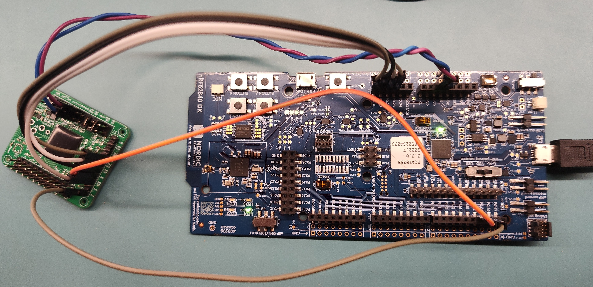
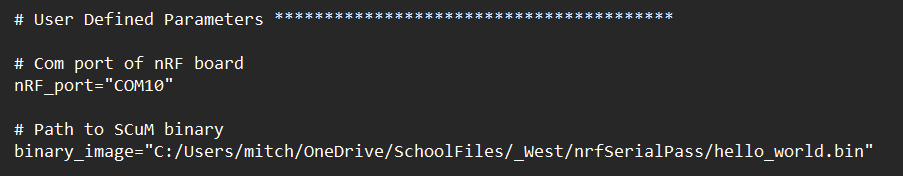
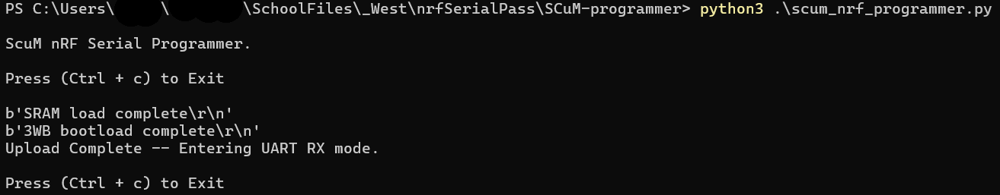

# SCuM Programmer

Load this firmware onto an nRF52840-DK to turn it into a programmer for SCuM!

The Single Chip micro-Mote (SCuM) is a 2x3mm2 single-chip standard-compatible Smart Dust chip, see https://www.crystalfree.org/

## Use

### program the nRF52840-DK

    Refer to "Getting Started SCµM.pdf" section 1.1 for details on programming the nRF52840-DK using the SEGGER embedded studio.

### interact with SCuM's serial port

* Connect SCuM's UART to the following pins on the nRF52840-DK

| DK      | SCuM                     |
| ------- | ------------------------ |
| `P0.02` | UART TX (SCuM transmits) |
| `P0.26` | UART RX (SCuM receives)  |
| `GND`   | `GND`                    |

### load code onto SCuM

scum_nrf_programmer.py is used to program SCuM using a pre-compiled binary.
The nRF52840-DK's COM port must be added to the script.
The desired binary is added to the script.(pay attention,\ -> /)

Execute the script from CL. (> python3 .\scum_nrf_programmer.py)
After a successful write the script will transition to serial receive mode printing messages transmitted from SCuM to the terminal.

*Notes - The calibration codes and other information transmitted during calibration/initialization are lost. 
The nRF52840-DK is limited to a a set of pre-defined baud rates. This can cause problems depending on the clock source used. HF clock works/LF clock will not.  
This modification has only been used and tested for SCuM message transmissions. No attempt has been made to test SCuM message receive capability.

### calibrate SCuM

_Coming soon!_

# Build

- install SEGGER Embedded Studio for ARM (Nordic Edition)
- open `scum-programmer/scum-programmer.emProject`
